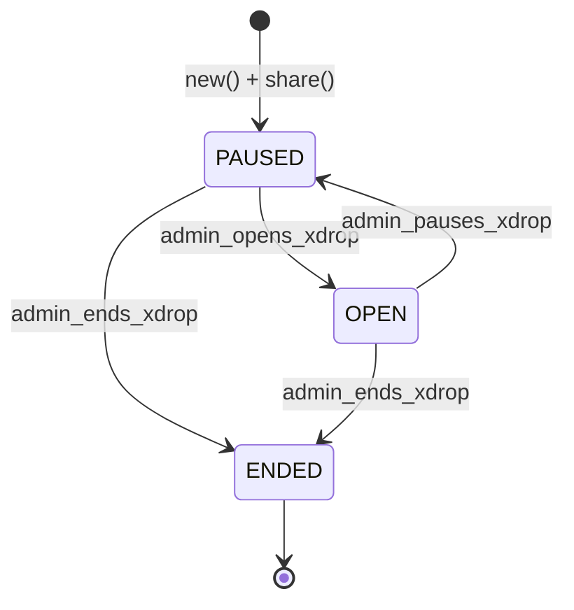

# xDrop

xDrop is a cross-chain airdrop system. It lets users claim coins on Sui by proving ownership of their Ethereum or Solana addresses via [SuiLink](https://www.suilink.io/).

## Project Structure

- [src/sui/](./src/sui/) - Sui Move smart contract.
- [src/sdk/](./src/sdk/) - TypeScript SDK to interact with the contract.
- [src/web/](./src/web/) - Web interface for users and admins.

## Object Lifecycle

Each XDrop object manages the distribution of a specific coin type (e.g., USDC) for addresses from a foreign network (Ethereum, Solana). The object tracks claims, holds the coin balance, and enforces the state transitions shown below.

- **PAUSED**: Initial state. Users cannot claim tokens. Admin can add claims.
- **OPEN**: Users can claim tokens. Admin can still add new claims.
- **ENDED**: Terminal state. Claims permanently disabled. Admin can reclaim any remaining balance.
